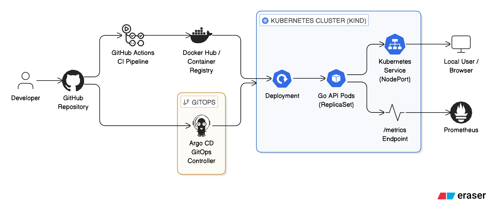

# Student Compute Platform – GitOps Demo

## Overview

This project demonstrates a lightweight cloud-native microservice deployed to Kubernetes using a GitOps workflow with Argo CD.

The goal of this project was to strengthen practical understanding of:

- Kubernetes primitives (Pods, Deployments, Services)
- Declarative infrastructure
- GitOps reconciliation patterns
- CI-driven container builds
- Observability fundamentals using Prometheus metrics
- Go in the cloud-native ecosystem

The service is a minimal Go HTTP API exposing application metrics and designed to be horizontally scalable and deployment-friendly.

---

## Architecture



- Developer Push → GitHub Actions → 
- Docker Image Build → Container Registry → 
- Argo CD Reconciliation → Kubernetes Deployment → Running Pods →
- Metrics exposed via `/metrics` endpoint

Kubernetes continuously reconciles desired state from Git using Argo CD.

---

## Prerequisites

You will need the following installed locally:

- Docker Desktop
- Go (1.22+ recommended)
- kubectl
- kind (Kubernetes in Docker)
- Helm
- A Docker Hub account (or GitHub Container Registry)

Mac (Homebrew):

```bash
brew install go
brew install kubectl
brew install kind
brew install helm
brew install --cask docker
```