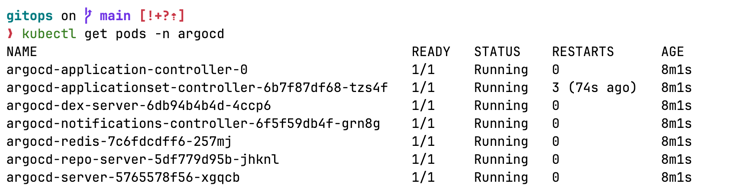
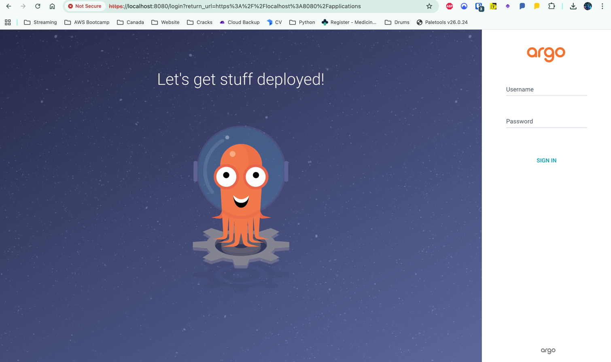
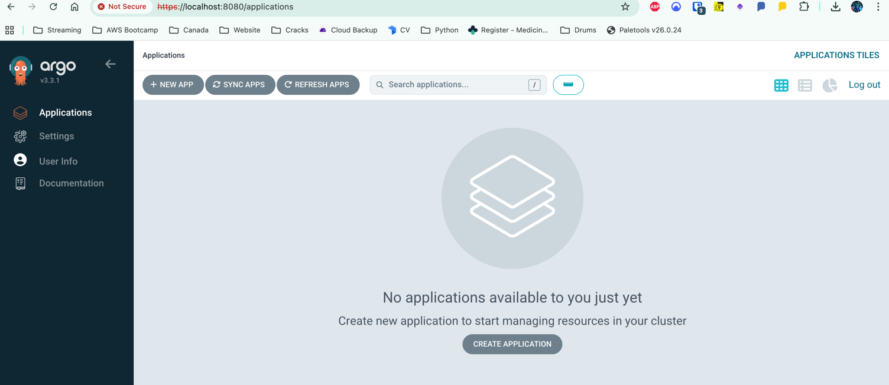

# 05 - Installing Argo CD

## Purpose

Argo CD enables a GitOps workflow where Kubernetes cluster state is continuously reconciled against declarative configuration stored in Git.

Instead of manually running `kubectl apply`, Argo CD ensures:

Cluster state == Git state

---

## Create Namespace

```bash
kubectl create namespace argocd
```

---

## Install Argo CD

```bash
kubectl apply -n argocd \
-f https://raw.githubusercontent.com/argoproj/argo-cd/stable/manifests/install.yaml
```

Wait for pods to be ready:

```bash
kubectl get pods -n argocd
```



All pods should be in `Running` state.

---

## Access Argo CD UI

Port forward the service:

```bash
kubectl port-forward svc/argocd-server -n argocd 8080:443
```

Open in browser:

```
https://localhost:8080
```



---

## Retrieve Admin Password

```bash
kubectl -n argocd get secret argocd-initial-admin-secret \
-o jsonpath="{.data.password}" | base64 --decode && echo
```

Login using:

- Username: admin
- Password: (decoded value above)



---

## Why Argo CD?

Argo CD provides:

- Continuous reconciliation
- Drift detection
- Declarative deployment
- Git as the single source of truth
- Automated rollouts

This forms the foundation of a GitOps-based delivery model.